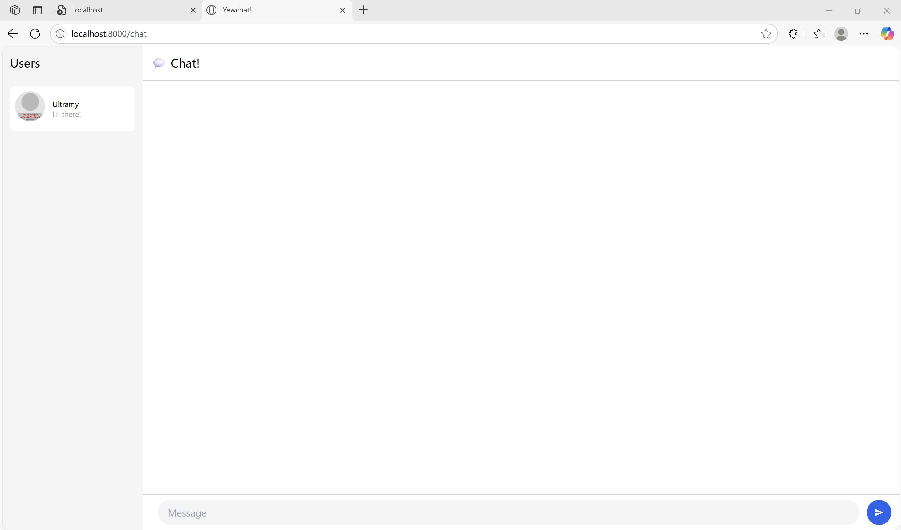
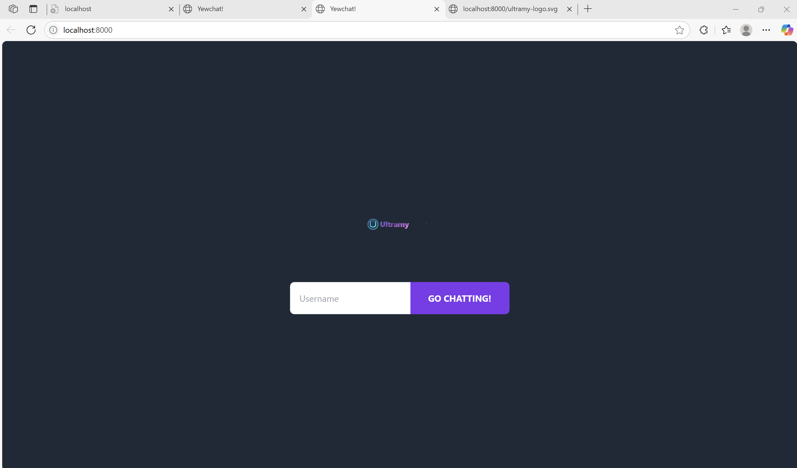

# YewChat 💬

> Source code for [Let’s Build a Websocket Chat Project With Rust and Yew 0.19 🦀](https://fsjohnny.medium.com/lets-build-a-websockets-project-with-rust-and-yew-0-19-60720367399f)

## Install

1. Install the required toolchain dependencies:
   ```npm i```

2. Follow the YewChat post!

## Branches

This repository is divided to branches that correspond to the blog post sections:

* main - The starter code.
* routing - The code at the end of the Routing section.
* components-part1 - The code at the end of the Components-Phase 1 section.
* websockets - The code at the end of the Hello Websockets! section.
* components-part2 - The code at the end of the Components-Phase 2 section.
* websockets-part2 - The code at the end of the WebSockets-Phase 2 section.

## Refleksi


Git clone dua buah repository. SimpleWebSocketServer dan YewChat. Buka tautan blog tutorial YewChat. Ikuti langkah - langkahnya. Lakukan npm i pada kedua repository yang sudah diclone. Lakukan npm start pada kedua repository yang sudah diclone.


Saya menambahkan elemen UI. Penambahan elemen dilakukan pada login. Elemen tersebut adalah logo. Logo tersebut berupa svg. File svg tersebut bernama ultramy-logo. Letaknya ada di direktori public.